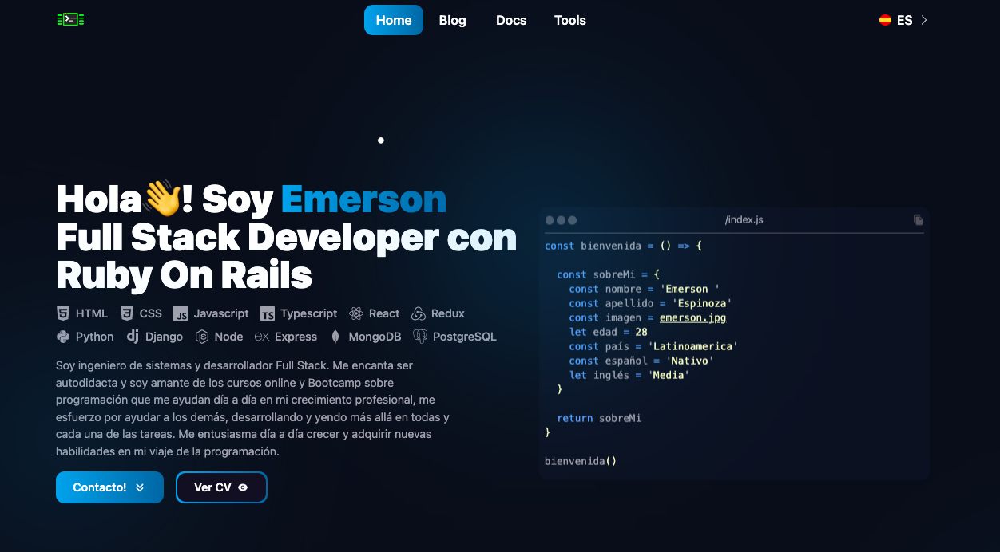

# Portfolio

Portafolio usado con vite - react .

Para levantar el proyecto
```bash
git clone 
```
```bash
npm install vite
```
```bash
npm run dev
```
```bash 
npm run dev -- -- host
```

## Demo proximamente


[Portfolio Website](https://portafolio-con-vite.vercel.app/)


## Screenshots


